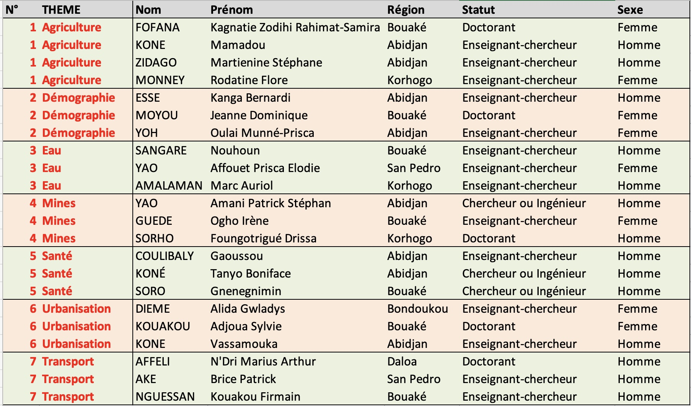

Tout au long de la semaine de formation, les après-midi seront consacrés à la réalisation d'ateliers où les stagiaires seront regroupés par équipe de trois ou quatre autour d'un thème. 

Chaque groupe devra produire un rapport permettant de montrer l'ensemble des acquis de la formation et suivant a priori le plan suivant.

# INTRODUCTION

> Presenter les membres de l'équipe et le thème attribué

> décrire les objectifs du rapport et formuler des hypothèses

# 1. ACQUISITION DE DONNEES

> Décrire les différents types de données qui seront mobilisées

> Sources ? dates ? couverture spatiale ?

> fonds de carte ? couches SIG, ...

# 2. ANALYSE STATISTIQUE AVEC R

> Décrire les variables intéressantes, produire des taleaux ou des graphiques

> Tester la relation entre deux variables 

> Synthétiser les résultats

# 3. ANALYSE CARTOGRAPHIQUE AVEC MAGRIT

> Produire différents types de carte 

> Mettre en page les cartes 

> Commenter les cartes

# 4. ANALYSE D'ENQUETE AVEC KOBO

> Construire un questionnaire

> Tester ce questionnaire auprès des participants de l'EE

> Proposer des améliorations

# CONCLUSION

> Synthétiser vos résultats principaux

> Décrire les difficultés rencontrées.

> Indiquer si vous souhaitez poursuivre les apprentissages

