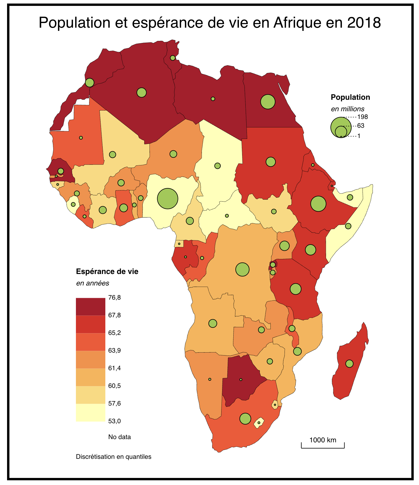

```{r}
library(knitr)
library(sf)
library(mapsf)
```


::: {.callout-tip}
## Télécharger le jeu de données
-  [Cliquer ici](https://github.com/worldregio/afromapr/raw/refs/heads/main/datazip/africa_pays_2018.zip)
:::

### Source

Cette base de données statistique sur le développement des pays d’Afrique en 2018 est un basée sur les rapport sur le développement humain de 2020, complété par quelques données de cadrages du CEPII. Le fonds de carte est issu quant à lui de la base Natural Earth. Le fichier est à citer comme suit :


 > **Données** : HDR 2020,  & CEPII /  **Fonds de carte** : Natural Earth


### Indicateurs

```{r}
meta<-read.table("data/africa_pays_2018/data/africa_pays_2018_meta.csv", header=T, sep=";",fileEncoding = "UTF-8")
kable(meta)
```

### Temps

Le rapport sur le développement humain est de 2020 mais la plupart des indicateurs concernent l’année 2018.

### Espace

Le fonds de carte est simplifié. Les unités spatiales sont codées en ISO3. Il est possible d'agréger l'Afrique en 5 régions suivant le découpage ONU. 

```{r}
map<-st_read("data/africa_pays_2018/geom/afrika_map.geojson")

mf_map(map,
       type="typo", 
       var="subregion")
mf_label(map, 
         var="iso3", 
         overlap=F,
         halo = T,
         cex = 0.4)
mf_layout("Code des unités spatiales",
          credits = "Source : Natural Earth",
          scale = T, 
          arrow=T, 
          frame=T)
```


### Utilisation avec Magrit


On peut facilement effectuer des jointures enre le fonds de carte et le jeu de données pour ensuite produire des cartes thématiques.



### Utilisation avec R

Ce jeu de données est très pratique pour l'enseignement de la statistique bivariée, en particulier les méthodes de corrélation, régression et analyse de variance.

