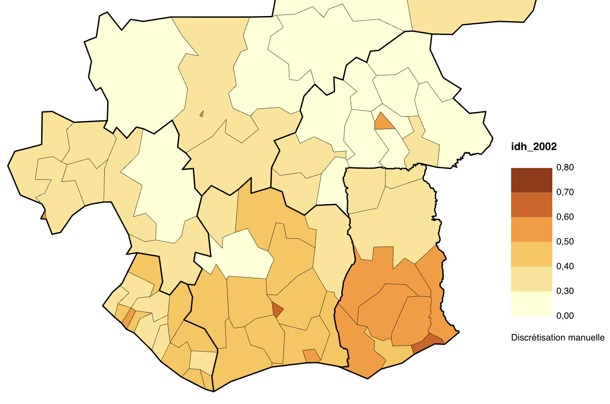
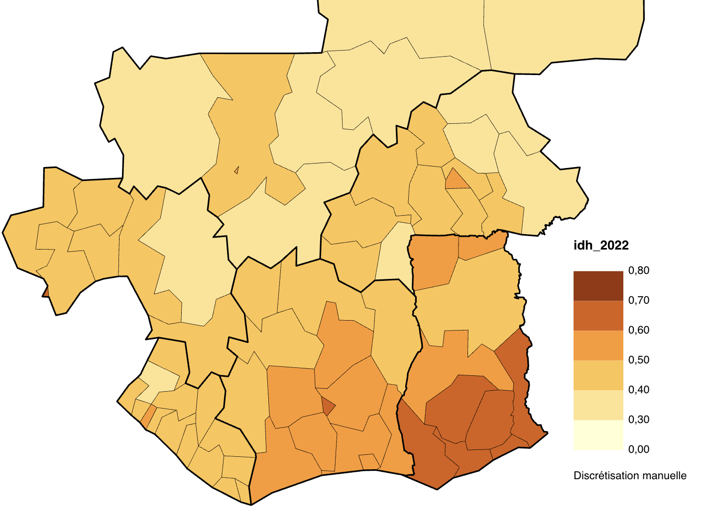

```{r}
library(knitr)
library(sf)
library(mapsf)
library(dplyr)
library(ggplot2)
```


::: {.callout-tip}
## Télécharger le jeu de données
-  [Cliquer ici](https://github.com/worldregio/afromapr/raw/refs/heads/main/datazip/africa_idh_1992_2022.zip)
:::

### Source

Cette base de données statistique et cartographique est un extrait du projet [Global Data Lab](https://globaldatalab.org/) et plus précisément de la compilation de données sur le développement humain au niveau infra-national [shdi](https://globaldatalab.org/shdi/) Toute utilisation de ces données implique de citer les auteurs comme suit 

> Data retrieved from the Subnational HDI Database of the Global Data Lab, https://globaldatalab.org/shdi/, version v7.0.
> Smits, J. and Permanyer, I. The Subnational Human Development Database. Sci. Data. 6:190038 https://doi.org/10.1038/sdata.2019.38 (2019).


### Indicateurs

```{r}
meta<-read.table("data/africa_idh_1992_2022/data/meta.csv", header=T, sep=";",fileEncoding = "UTF-8", quote ='"')
kable(meta)
```

### Temps

Les données sont calculées chaque années (éventuellement par interpolation) sur le site web mais avec des valeurs manquantes lorsqu'aucun recensement ou enquête DHS n'a eu lieu. Nous avons retenu uniquement les données des années 1992, 2002, 2012 et 2022.

### Espace

Le fonds de carte utilisé par GDL est souvent un découpage administratif mais il peut arriver qu’il procède à des regroupements, notamment lorsque les données viennent d’enquête comme le DHS.  Nous avons procédé à sa simplification à l’aide de mapshaper (https://mapshaper.org/) pour alléger sa taille et rendre plus facile son utilisation sous MAGRIT ou dans R.  Nous avons limité l’extraction aux pays d’Afrique.

Le fonds de carte est disponible au niveau infrantional mais également au niveau agrégé des pays. 

```{r}
reg<-st_read("data/africa_idh_1992_2022/geom/map_reg.geojson", quiet = T)
sta <- st_read("data/africa_idh_1992_2022/geom/map_sta.geojson", quiet =T)

mf_map(reg,
       type="typo", 
       var="iso_code",
       leg_pos = NA,
       lwd=0.5,
       border="white")
mf_map(sta, 
       type = "base",
       col = NA,
       lwd = 1,
       add=T)
mf_label(sta, 
         var="iso_code", 
         overlap=F,
         halo = T,
         cex = 0.4)
mf_layout("Découpage infranational de l'Afrique",
          credits = "Source : Global Data Lab",
          scale = F, 
          arrow=T, 
          frame=T)
```


On peut facilement extraire un ou plusieur pays. Voici par exemple le découpage pour l'ensemble Côte d'Ivoire, Ghana, Togo, Benin : 

```{r}
sel <- c("CIV","GHA","TGO","BEN")
reg2 <-reg[reg$iso_code %in% sel,]
sta2 <- sta[sta$iso_code %in% sel,]


mf_map(reg2,
       type="typo", 
       var="iso_code",
       leg_pos = NA,
       lwd=0.5,
       border="white")
mf_map(sta2, 
       type = "base",
       col = NA,
       lwd = 1,
       add=T)
mf_label(reg2, 
         var="gdlcode", 
         overlap=F,
         halo = T,
         cex = 0.4)
mf_layout("Code des unités infranationales",
          credits = "Source : Global Data Lab",
          scale = F, 
          arrow=T, 
          frame=T)
```


### Utilisation avec Magrit

Les données sont incluses avec le fonds de carte dans le fichier *map_reg.geojson*.  Il est donc facile de construire une grande diversité d'exercices à partir de ce fichier unique puisqu'il comporte des données à plusieurs dates et pour plusieurs pays. 

On peut par exemple suivre l'évolution de l'indicateur de développement humain de 2002 à 2022 dans les régions de Côte d'Ivoire et des pays voisins.

:::: {.columns}

::: {.column width="50%"}
{width=300}
:::


::: {.column width="50%"}
{width=300}
:::
::::


### Utilisation avec R

Ce jeu de données est très pratique pour l'enseignement de la statistique bivariée, en particulier les méthodes de corrélation, régression et analyse de variance. Comme dans le cas de la cartographie, il permet de comparer les résultats pour plusieurs pays, plusieurs dates, etc.

Si l'on reprend l'exemple de l'évolution de l'IDH entre 2002 et 2022 pour la Côte d'Ivoire et les pays voisins, on peut réaliser une série d'analyses de régression : 

```{r}
don<-readRDS("data/africa_idh_1992_2022/data/don_reg.RDS")
sel <- don %>% filter(iso_code %in% c("CIV","LBR","GIN","BFA","MLI","GHA"))
ggplot(sel) + aes(x=idh_2002, y=idh_2022) +
      geom_point() +
      geom_smooth( method= "lm",fill = NA)+
  scale_x_continuous("IDH en 2002") +
  scale_y_continuous("IDH en 2022") + facet_wrap(~country)
```


