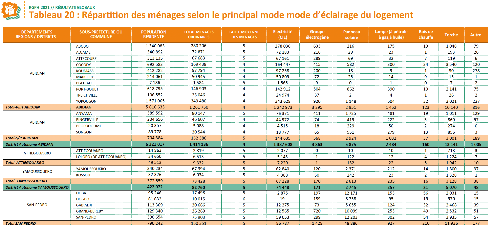
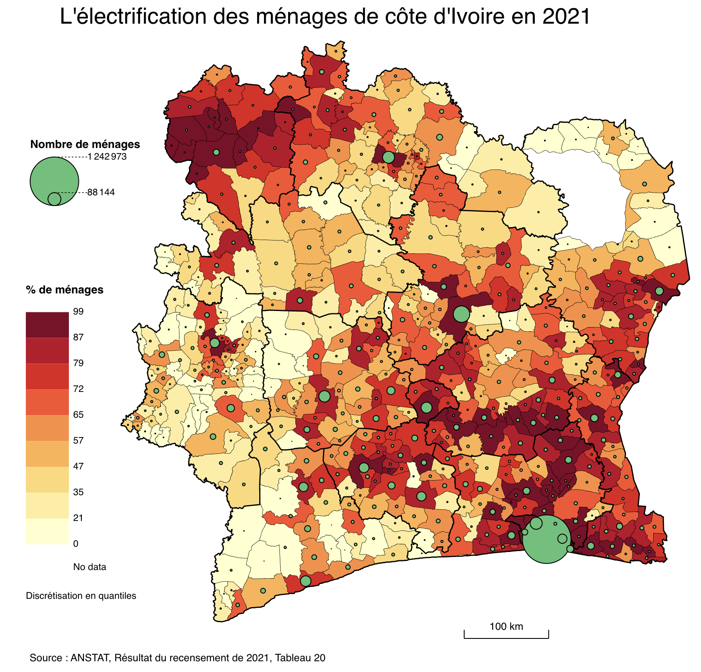

```{r}
library(knitr)
library(sf)
library(mapsf)
library(dplyr)
library(ggplot2)
```


::: {.callout-tip}
## Télécharger le jeu de données
-  [Cliquer ici](https://github.com/worldregio/afromapr/raw/refs/heads/main/datazip/africa_idh_1992_2022.zip)
:::

### Source

Cette base de données statistiques et cartographiques vise à permettre la cartographie et l'analyse des résultats du recensement de population de Côte d'Ivoire de 2021 à trois niveaux d'agrégation :

- 14 districts
- 112 départements
- 510 communes (sous-préfectures)

La difficulté de constitution de cette base était lié à deux problèmes :

1. **Extraction des statistiques** : Le site du recensement fournit un très grand nombre de tableaux détaillés au niveau des 510 communes. Mais ils sont fournis sous la forme de fichiers .pdf et non pas de tableaux excel sur [cette page web](https://rp2021.anstat.ci/publication/)


2. **Jointure avec un fonds de carte** : Le recensement de 2021 utilise une nouvelle division administrative par rapport aux précédents. Il a donc fallu à la trouver le fonds de carte adapté et proposer un code des unités facilitant la liaison avec les tableaux du recensement et l'agrégation aux niveaux supérieurs. Le fonds de carte des 510 unités de base a finalement été trouvé sur le site [sigfu.ci](https://sigfu.ci/explorer/fr/jeux-de-donnees/limites-communes/info) mais il a fallu modifier les codes des unitéspour les mettre en phase avec la nouvelle géographie administrative.

Les données doivent donc recevoir la citation suivante :

> Données statistiques : RP 2021, ANSTAT
> Données géométriques : d'après SIGFU, 2023

### Codage des unités

Nous fournissons un tableau de référence pour servir de point de départ à l'ajout de nouvelles colonnes.

```{r}
library(readxl)
ref<-read_xlsx("data/civ_rp_2021/data/coderef.xlsx")
kable(head(ref))
```

Les variables sont les suivantes : 

- **oldcode** : code initial fournit par SIGFU
- **dis_code** : code du district *(A, B, ... )*
- **dis_nom** : nom du district
- **dep_code** : code du département *(A1, A2, ...)*
- **dep_nom** : nom du département
- **spr_code** : code de la sous-préfecture *(A101, A102, A103 ...)*
- **spr_nom** : nom de la sous-préfecture
- **pop** : nombre d'habitant recensés en 2021
- **men** : nombre de ménages recensés en 2021


::: {.callout-important}
Les codes ont été choisis de façon à suivre l'ordre des tableaux du recensement ce qui doit faciliter le recollage des données. 
:::


### Indicateurs

L'extraction des indicateurs doit se faire tableau par tableau. Il est en général possible de convertir les fichiers .pdf en tableau Excel à l'aide de sites webs tels que [pdfCandy](https://pdfcandy.com/pdf-to-excel.html), mais il faut ensuite effectuer un nettoyage à la main des lignes pour ne conserver que celles qui concernent le niveau le plus fin et éliminer celles relatives aux départements ou districts. Ces dernières seront en effet automatiquement calculés en effectuant les sommes à l'aide de la table des codes. 


A titre d'exemple, nous avons extrait les données du tableau 20 qui concerne le mode d'éclairage des ménages et se présente comme suit : 



Après avoir saisi le tableau, on obtient le fichier suivant :

```{r}
library(readxl)
don<-read_xlsx("data/civ_rp_2021/data/tab20_eclairage.xlsx")
kable(head(don[,5:15]))
```

Le nom des variables est construit de façon à rappeler le thème du tableau d'origine (*men_ecl* = ménages en fonction du type d'éclairage) auquel on ajoute un suffixe pour chaque modalité : 

- **men_ecl_elec** : éclairage par raccordement électrique
- **men_ecl_grouo** : éclairage par groupe électrogène
- **men_ecl_solair** : éclairage par panneau solaire
- **men_ecl_lampe** : éclairage par lampe
- **men_ecl_bois** : éclairage par feu de bois
- **men_ecl_torche** : éclairage par torche
- **men_ecl_autre** : éclairage par autre moyen

### Temps

Les données concernent toutes le recencement de population de 2021

### Espace

Le fonds de carte comprend en fait 511 unités car il faut ajouté aux 510 préfectures le parc de Bono qui est absent du recensement. Trois fonds de carte sont fournis qui se superposent parfaitement :

- civ_spr_511.geojson : découpage en 511 sous-préfectures
- civ_dep_112.geojson : découpage en 112 départements
- civ_dis_14.geojson : découpage en 14 districts

```{r}
spr <- st_read("data/civ_rp_2021/geom/civ_spr_511.geojson", quiet = T)
dep <- st_read("data/civ_rp_2021/geom/civ_dep_112.geojson", quiet = T)
dis <- st_read("data/civ_rp_2021/geom/civ_dis_14.geojson", quiet = T)

mf_map(spr, type = "typo", var = "dis_code", leg_pos=NA, lwd=0.5, border="white")
mf_map(dep, type = "base", lwd=1, col = NA, border="black", add=T)
mf_map(dis, type = "base", lwd=2,col = NA, border="black", add=T)
mf_layout(title = "Découpage de la Côte d'Ivoire au RP 2021",
          frame=T, scale = F, credits = "d'après SIGFU 2023 (https://sigfu.ci) ")
```


### Utilisation avec Magrit

Après avoir chargé le fonds de carte des 511 sous-préfecture et effectué la jointure avec le tableau excel des données sur l'éclairage, on peut réaliser la carte ci-dessous sans quitter MAGRIT. 




L'exercice suppose la maîtrise de plusieurs fonctions :

- 1. Agrégation des sous-préfecture en districts
- 2. Création de l'indicateur rapportant les ménages ayant l'électricité au total des ménages
- 3. Ajout de la carte choroplèthes du taux d'électrification
- 4. Ajout de la carte de stock donnant le nombre de ménages ayant l'électricité
- 5. Habillage de la carte

### Utilisation avec R

R permet de procéder à des analyses statistiques mais aussi de transformer le tableau en l'agrégeant à des niveaux supérieurs (départements, districts, ...). Il permet aussi d'effectuer des opérations d'analyse spatiale en calculant la surface des unités spatiales, la distance à la capitale ...

